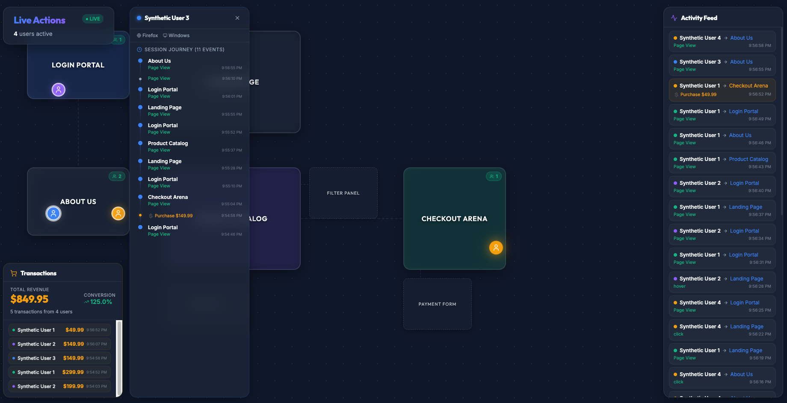

# UserTelemetryViewer — gamified telemetry, live on your screen

[](https://www.typescriptlang.org/)
[](https://react.dev/)
[](https://socket.io/)
[](https://vite.dev/)
[](LICENSE)

> **Current Status: Alpha — Exploratory Development**

A real-time 2D dashboard that transforms website telemetry into a living virtual map. Instead of staring at charts, watch your users navigate your site as animated avatars moving between rooms.



## Why?

Every analytics tool shows you numbers. UserTelemetryViewer shows you *people* — colored circles floating through a glassmorphic floor plan, hopping from Login Portal to Product Catalog to Checkout Arena. Hover over an avatar to see their browser, OS, current page, and last action. Watch the activity feed scroll in real time. See which rooms are crowded at a glance.

Inspired by virtual office simulations and AI agent visualizers, but built for website traffic.

## Quick Start

```bash
git clone https://github.com/RogueCtrl/UserTelemetryViewer.git
cd UserTelemetryViewer
npm install
```

Run the full stack in three terminals:

```bash
# Terminal 1: Frontend dev server
npm run dev

# Terminal 2: WebSocket backend
npx ts-node server.ts

# Terminal 3: Synthetic telemetry (optional — for demo)
node simulate_posthog.js
```

Open `http://localhost:5173` and watch the avatars move.

## How It Works

```
┌─────────────────┐     POST /api/events     ┌──────────────────┐     WebSocket      ┌──────────────────┐
│  Your Website   │ ─────────────────────▶   │    server.ts     │ ─────────────────▶ │  React Frontend  │
│  (or simulator) │  PostHog JSON payload    │ Express+Socket.io│  Real-time push    │ (localhost:5173) │
└─────────────────┘                          └──────────────────┘                    └──────────────────┘
```

1. **Telemetry comes in** — Any source POSTs PostHog-shaped events to `/api/events`
2. **Server maps URLs to rooms** — `/checkout` → Checkout Arena, `/products/*` → Product Catalog, etc.
3. **Avatars get coordinates** — Server picks a random position inside the target room
4. **WebSocket broadcasts** — All connected frontends receive the update instantly
5. **CSS does the rest** — Smooth cubic-bezier transitions glide avatars to their new positions

## Sending Real Events

Replace the simulator with real telemetry by POSTing to `/api/events`:

```bash
curl -X POST http://localhost:3001/api/events \
  -H "Content-Type: application/json" \
  -d '{
    "event": "$pageview",
    "properties": {
      "distinct_id": "user_abc123",
      "$current_url": "https://yoursite.com/products",
      "$browser": "Chrome",
      "$os": "Mac OS X",
      "name": "Jane Doe"
    }
  }'
```

Or point a [PostHog webhook](https://posthog.com/docs/webhooks) directly at your server.

## Features

- **Live avatar map** — Colored circles with bouncy CSS animations move between 5 rooms
- **Hover tooltips** — User name, current room, last action, browser, OS, and URL
- **Activity feed** — Scrolling sidebar showing the last 30 events in real time
- **Room occupancy badges** — Green pills showing user count per room
- **Connection paths** — Dashed SVG lines showing navigation routes between rooms
- **LIVE/OFFLINE indicator** — Pulsing badge reflects WebSocket connection state
- **Consistent user colors** — Same user always gets the same color (hash-based)
- **Auto-cleanup** — Stale users evicted after 2 minutes of inactivity
- **PostHog-compatible** — Drop-in endpoint for PostHog webhooks
- **Checkout transactions** — Floating 💲 animation on purchase events with golden avatar glow
- **Transaction panel** — Live revenue counter, conversion rate, and recent transaction list
- **Sub-rooms** — Adjoining mini-rooms for drawers, modals, and page modes attached to parent rooms
- **Premium dark mode** — Glassmorphism, dot-grid background, smooth gradients

## The Rooms

| Room | Maps to URLs containing | Sub-rooms |
|------|------------------------|----------|
| 🚪 Login Portal | `/login` | |
| 🏠 Landing Page | Root URL (`/`) | |
| 📦 Product Catalog | `/products` | Filter Panel, Quick View |
| 💳 Checkout Arena | `/checkout` | Payment Form |
| ℹ️ About Us | `/about` | |

Sub-rooms appear as smaller dashed panels attached to their parent room. Avatars move into them on `drawer_opened`, `modal_opened`, or `form_focused` events.

Adding a new room takes ~4 lines of code. See [AGENTS.md](AGENTS.md) for instructions.

## Tech Stack

| Layer | Technology |
|-------|-----------|
| Frontend | React 19 + TypeScript (Vite) |
| Styling | Vanilla CSS with glassmorphism |
| Icons | Lucide React |
| Backend | Express + Socket.io |
| Communication | REST ingestion → WebSocket broadcast |
| Simulator | Node.js script with `node-fetch` |

## Project Structure

```
├── server.ts              # Express + Socket.io backend
├── simulate_posthog.js    # Synthetic PostHog event generator
├── src/
│   ├── App.tsx            # Main app — WebSocket client, header, activity feed
│   ├── index.css          # Design system — variables, glass-panel, animations
│   └── components/
│       ├── GameMap.tsx     # Room layout, occupancy counts, SVG paths
│       ├── Room.tsx        # Individual room panel with badge
│       ├── Avatar.tsx      # Animated avatar with hover tooltip
│       └── TransactionPanel.tsx  # Revenue counter + recent purchases
├── docs/
│   └── screenshot.png     # Dashboard screenshot
├── AGENTS.md              # Full architecture guide for AI coding agents
├── CONTRIBUTING.md        # How to contribute
├── CODE_OF_CONDUCT.md     # Contributor Covenant v2.1
├── SECURITY.md            # Security policy
├── CHANGELOG.md           # Version history
└── LICENSE                # MIT
```

## Roadmap

- [x] **Checkout transactions** — Floating 💲 animation on purchase events with transaction panel, revenue counter, and conversion rate
- [x] **Sub-rooms for page elements** — Adjoining mini-rooms for on-page drawers, modals, and alternate page modes (Filter Panel, Quick View, Payment Form)
- [ ] **A\* pathfinding** — Avatars walk between rooms instead of teleporting
- [x] **Session timelines** — Click an avatar to see their full journey through the site
- [ ] **Room furniture** — Add visual elements inside rooms (shopping carts, forms, etc.)
- [ ] **Multiple floors** — Navigate between different map views for different site sections
- [ ] **Real PostHog webhook adapter** — Production-ready integration with auth
- [ ] **Segment / Mixpanel adapters** — Support more analytics platforms
- [ ] **Configurable room layouts** — JSON-based map definitions so anyone can model their site
- [ ] **User search** — Find a specific user on the map
- [ ] **Historical replay** — Scrub through time to see past traffic patterns

## Contributing

Contributions are welcome! See [CONTRIBUTING.md](CONTRIBUTING.md) for setup instructions and guidelines.

## License

[MIT](LICENSE) — Matt Cox, 2026
